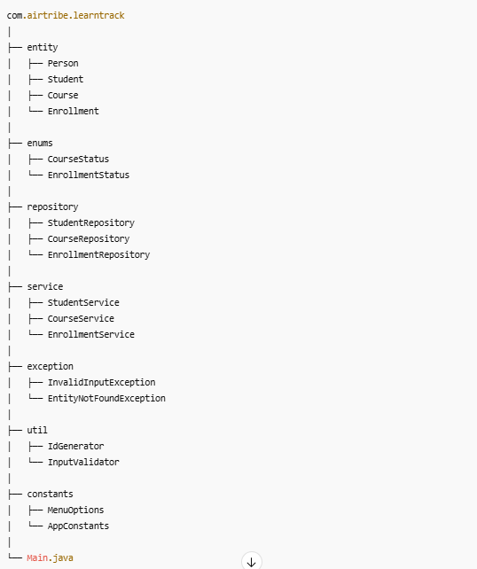

# **LearnTrack – Student & Course Management System**

LearnTrack is a console-based Student & Course Management System built using Core Java.
It allows admins to:

* Manage Students
* Manage Courses
* Manage Enrollments
* Deactivate Students
* Activate / Deactivate Courses
* Mark enrollments as Completed / Cancelled

This project focuses on mastering Core Java, OOP principles, Collections, Exception Handling, and clean architecture — without using any database or frameworks.

## **Learning Objectives**

By building LearnTrack, you will understand:

1. [ ] Java syntax & structure
2. [ ] Classes, Objects & Constructors
3. [ ] Encapsulation, Inheritance & Polymorphism
4. [ ] Static vs Instance members
5. [ ] Collections (ArrayList)
6. [ ] Custom Exceptions & Try-Catch
7. [ ] Clean modular application structure
8. [ ] Menu-driven console application

## **Project Structure**



## Features
### Student Management

* Add Student
* View Students
* Deactivate Student
* Student cannot enroll if inactive

## Course Management

* Add Course
* View Courses
* Activate Course
* Deactivate Course
* Cannot enroll into inactive course

Enrollment Management

* Enroll student in course
* Prevent duplicate active enrollment
* View student enrollments
* Mark as Completed
* Cancel enrollment
* Prevent invalid operations like:
      --Cancelling completed enrollment
       --Completing cancelled enrollment

## Tech Stack

| Tool              | Purpose                |
| ----------------- | ---------------------- |
| Java Core         | Development            |
| IntelliJ IDEA     | IDE                    |
| ArrayList         | In-memory data storage |
| Custom Exceptions | Error Handling         |

## How to Run

### Requirements

* JDK 17+ / JDK 21 Recommended
* IntelliJ or Eclipse

### Run in IntelliJ
1. Open IntelliJ
2. Open this project
3. Run Main.java
4. Follow console menu options 

### Run Via Terminal
1. [ ] javac Main.java
2. [ ] java Main


### Sample Output

``===== LearnTrack Menu =====
1. Add Student
2. View Students
3. Deactivate Student
4. Add Course
5. View Courses
6. Enroll Student to Course
7. View Student Enrollments
8. Complete Enrollment
9. Cancel Enrollment
10. Deactivate Course
11. Activate Course
12. Search Student By ID
13. Exit
    `Enter choice:``

### Key Concepts Demonstrated

* Encapsulation (private fields + getters/setters)
* Inheritance (Student extends Person)
* Polymorphism (overriding toString)
* Static utilities (IdGenerator)
* ArrayList collections
* Custom Exceptions
* InvalidInputException
* EntityNotFoundException
* Separation of Concerns
* Entity → Repository → Service → UI Layer

```mermaid
classDiagram

class Person {
  -int id
  -String firstName
  -String lastName
  -String email
}

class Student {
  -String batch
  -StudentStatus status
  +getFullName()
}

class Course {
  -int id
  -String courseName
  -String description
  -int durationInWeeks
  -CourseStatus status
}

class Enrollment {
  -int id
  -int studentId
  -int courseId
  -LocalDate enrollmentDate
  -EnrollmentStatus status
}

class StudentRepository
class CourseRepository
class EnrollmentRepository

class StudentService
class CourseService
class EnrollmentService

class Main

Person <|-- Student

StudentService --> StudentRepository
CourseService --> CourseRepository
EnrollmentService --> EnrollmentRepository

EnrollmentService --> StudentService
EnrollmentService --> CourseService

Main --> StudentService
Main --> CourseService
Main --> EnrollmentService

Student --> Enrollment
Course --> Enrollment

`````
- `Person` is the parent class  
- `Student` extends `Person` (inheritance)
- `Student`, `Course`, and `Enrollment` are main entities
- Repositories store data (`ArrayList`)
- Services contain business logic
- `Main` calls services
- `EnrollmentService` depends on both StudentService & CourseService

## Documentation

Located in /docs
0. [ ] Setup_Instructions.md
1. [ ] JVM_Basics.md
2. [ ] Design_Notes.md
Submission Ready - Final Version
